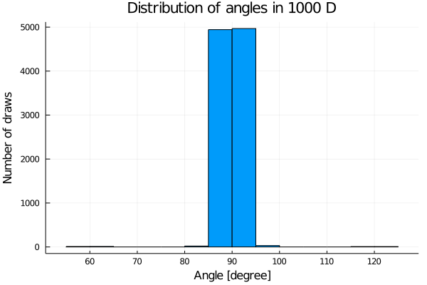

# Klątwa wymiaru

Mamy hiperkulę o promieniu równym 1 wpisaną w hipersześcian o krawędziach długości 2. Zapełniamy hipersześcian losowymi punktami o równomiernym rozkładzie.

## Punkt 1
Mierzymy rozkład punktów wewnątrz wielowymiarowego sześcianu.

Ustaliłem liczbę punktów na $10^4$, dla kazdego wymiaru doświdaczenie ponawiałem 10 razy aby zwiększyć wiarygodoność wyników.
Wykres zawiera uśrednione wyniki wraz z odchyleniem standardowym.

> Okazuje się, że wraz ze wzrostem ilości wymiarów drastycznie
maleje liczba punktów wewnątrz sfery -  co oznacza, że narożniki są znacznie bardziej pojemne 
niż środek sześcianu (hiperkula wpisana w ten sześcian).

## Punkt 2
Tutaj będziemy badać odległości między punktami w hipersześcianie.

| |  |
|:-------------------------:|:-------------------------:|
{ width=50% }|  { width=50% }
Każde doświadczenie powtórzyłem 5 razy, losowałem po 100 punktów i liczyłem odległości dla każdego z każdym -
na osi Y mamy serię uśrednionych wartości odchylenia standardowego i uśrednioną serię średniej odległości między punktami dla konkretnego wymiaru.

> Widać, że wraz ze wzrostem liczby wymiarów średnia odległość rośnie w skali logarytmicznej.

## Punkt 3

Tutaj badamy rozkład kątów między wektorami utworzonymi z wylosowanych punktów wewnątrz sześcianu.

| |  |
|:-------------------------:|:-------------------------:|
{ width=50% }|  { width=50% }
{ width=50% }|  { width=50% }
{ width=50% }|  { width=50% }

Losowałem 1000 punktów i do uzyskania poszczególnego histogramu 
robiłem 10 tysięcy losowań (2 wektory, po 2 punkty na wektor) z których obliczałem kąt z iloczynu wektorowego.

$$
    \phi(v_1, v_2) = arccos(\frac{v_1 \cdot v_2 }{ || v_1 || \cdot || v_2 || })
$$

> Obserwujemy, ze wraz ze wzrostem wymiarów kąty między wektorami są coraz ciaśniej rołożone między kątem $90°$. 
>
> Mozemy więc wywnioskować, ze mierzenie podobieństwa między wektorami za pomocą wzoru wyżej (kąta bądź wartości cosinusa) 
> nie będzie się dobrze sprawdzać. 