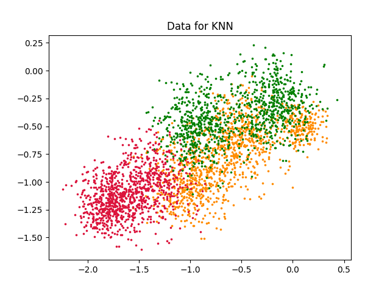
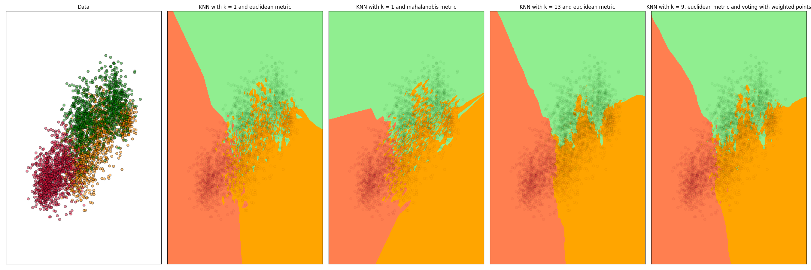
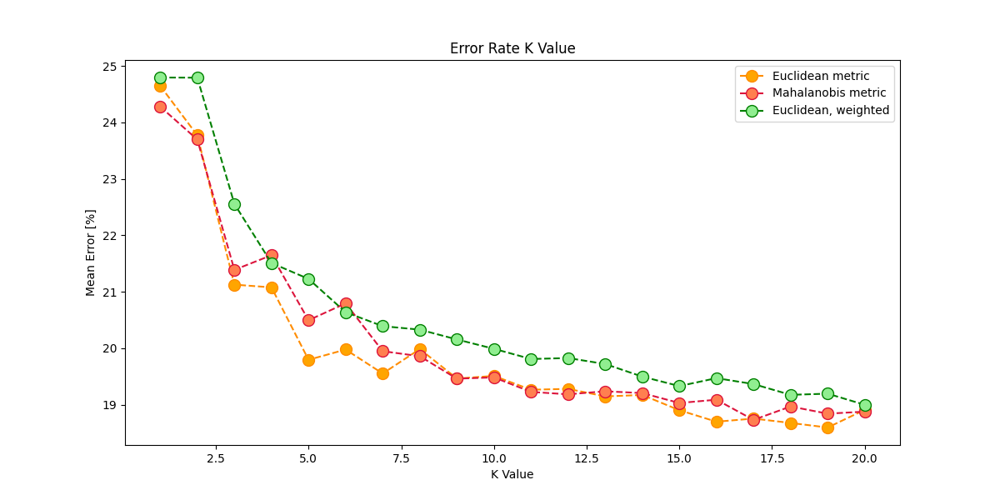
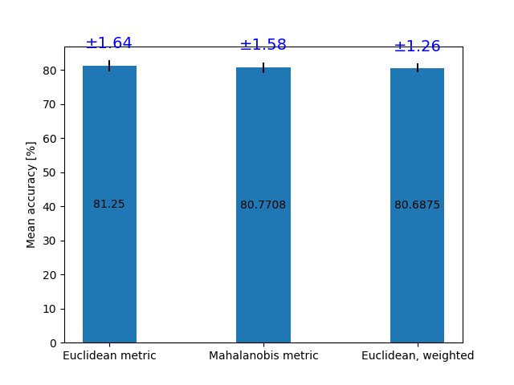

# Eksperymenty z k-NN

## Dane 

Zbiory danych wygenerowałem proceduralnie.
Dla każdej klasy wykorzystałem dwa albo trzy `bloby` dobierając 
odchyelnie standardowe tak, aby dane wyraźnie na siebie nachodziły - przykładowo
klasa `zielona` jest niejako przecięta klasą pomarańczową. 




Egzemplarzy każdej klasy jest po 1000, za wyjątkiem klasy `pomarańczowej` których jest 1200.

\newpage
## Granica Decyzyjna

Badamy granicę decyzyjną dla poszczególnych hiperparamterów:

- k-NN z k=1, głosowaniem większościowym i metryką Euklidesa;
- k-NN z k=13, głosowaniem większościowym i metryką Euklidesa;
- k-NN z k=1, głosowaniem większościowym i metryką Mahalanobisa;
- k-NN z k=9, głosowaniem ważonym odległością i metryką Euklidesa.



Dla k=1:

- dostajemy bardzo poszatkowaną przestrzeń - szczególnie dobrze wiadać w miejscu gdzie klasa pomarańczowa
 przecina dwie główne zgrupowania klasy zielonej.
- widzimy też różnicę w metrykach między euklidesową, a mahalanobisa:
$$ d(x, y) = \sqrt{(x - y)^T S^{-1} (x - y) } $$, gdzie S to macierz kowariancji.
- Jako, że rozłożenie naszych danych było zdecydowanie nierównomierne i przekrzywione, macierz kowariancji:
```
          [[0.36440023 0.16015485]
          [0.16015485 0.13401288]]
```
- todo
 
Dla k = 9:

- todo
 
Dla k = 13:

- todo


\newpage

## Ocena sprawności klasyfikatora 

Tu zdecydowałem się przetestować wszystkie powyższe konfiguracje.
Procedurę z wyborem k dla poszczególnego klasyfikatora powtarzałem po 15 razy, a później 
całość (czyli wybór i ocena klasyfikatora) również po 15 razy.


### Wybór k

Na początku należało wybrać k dla którego średnia skuteczność była najlepsza.



Na wykresie są uśrednione błedy z ($15 \cdot 15 = 225$) powtórzeń dla próbowanych k.
Błędy są liczone na losowym zbiorze walidacyjnym (tak jak w treści).

> Widać, że dla takiego rozłożenia danych większe k średnio wypadało lepiej dla każdego
> klasyfikatora.

\newpage

### Średnia skuteczność 
Następnie sprawdzamy średnią skuteczność klasyfikatorów z najlepszym dla niego k.



> Okazuje się, że wszystkie te klasyfikatory radzą sobie niemalże tak samo dobrze.
> A im wyższa dokładność tym większe odchylenie standardowe.


