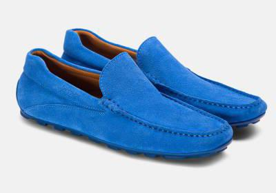
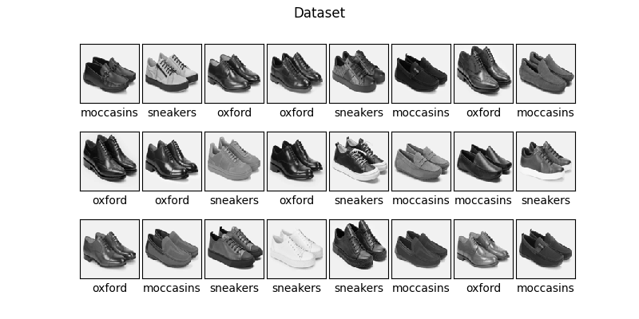
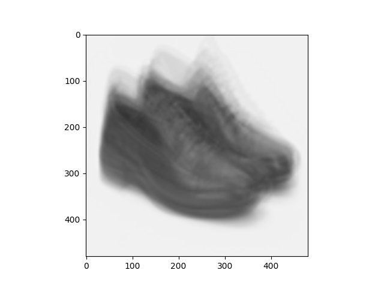
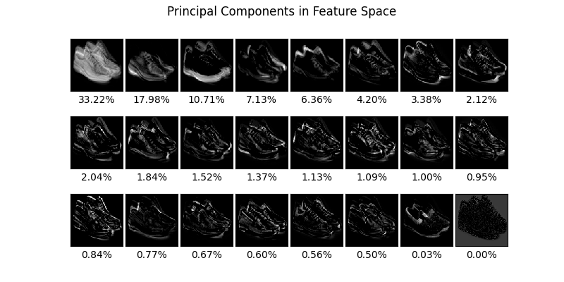
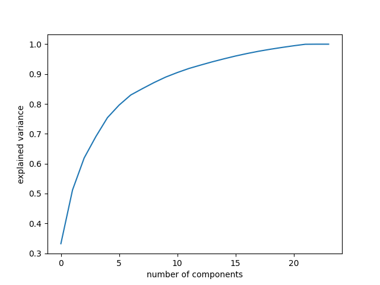
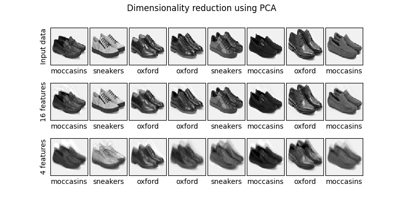
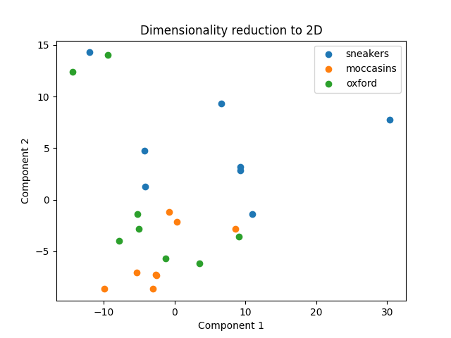

# Główne składowe butów

## Dane 

Jako dane wybrałem zdjęcia ze sklepu Kazar (nie, nie jest to zbiór Zalando MNIST :) ), po 8 par sneakersów, oxfordów i mokasynów.
Wszystkie zdjęcia były robione z tego samego ujęcia i po przycięciu (aby wycentrować) mają wymiary 400x280.

Takie zdjęcia sprowadzałem do wymiarów 100 na 100 i skali szarości, a całość
trzymałem w macierzy z (100x100 = 10000, 24) - każda kolumna to zdjęcie.

## Średnie zdjęcie

Najwyraźniej widać w nim rysy oxfordów i sneakersów.
Jako że buty na zdjęciach były wycentrowane, nie widzimy zbyt dużego rozmazania oprócz tego, które bierze się 
z faktu, że były to zdjęcia różnych butów.

## Wektory bazowe - Principal Components

Wariancja w zależności od ilości wybranych wektorów bazowych (principal components).

Możemy zauważyć, że większość wariancji jest opisywana przez zaledwie kilka wektorów bazowych (przy dziesięciu mamy 90%)
co sugeruje, że pozbycie się tych, które wnoszą najmniej, nie powinno nas kosztować dużo dokładności. 

\newpage

## Redukcja wymiarowości
Redukujemy wymiarowość naszych obserwacji do szesnastu i czterech najważniejszych cech.

Pokazałem tu tylko 8 zdjęć i sprawdziłem, jak wyglądają po redukcji wymiarów i przed (wertykalnie).
Przy szesnastu nie widać dużej straty jakości, natomiast przy czterech zdjęcia są wyraźnie rozmyte - natomiast dalej
dobrze widać ich rysy.

## Redukcja wymiarowości do 2D

Z wyjątkiem klasy zielonej, która niejako przecina klasę pomarańczową i kilku outlierów, klasy są odseparowane od siebie.
k-NN całkiem przyzwoicie radzi sobie z wysepkami jednych klas w innych natomiast ciężko powiedzieć jak rozłożyłyba się większa ilość
danych - już przy tych 24ech egzemplarzach mamy stosunkowo duży ich rozrzut i ciężko stwierdzić czy nie przesadziliśmy z redukcją wymiarów 
(co skądinąd i tak bardzo dobrze wygląda, jak na tylko dwa wymiary!)

