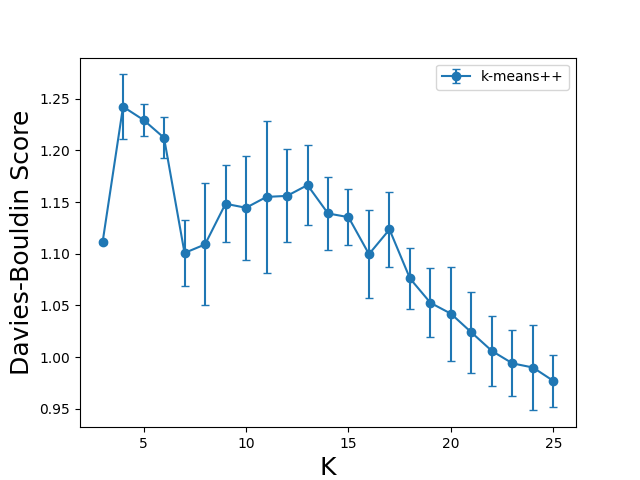

# Restauracja "Pod Złotymi Łukami"

## Dane 

Dane, którymi zajmujemy się tutaj zajmujemy to obserwacje reprezentujące dania. 
W ramach posprzątania danych usunąłem dane nieliczbowe i znormalizowałem je (poszedłem odrobinę na łatwiznę i
wszystkie zmapowałem do przedziału [0, 1])

Na tak przygotowanych danych wykonywałem dalszą część zadania.

## Szacowanie jak "dobra" jest klasteryzacja

### Metryka

Wybrałem indeks Daveisa-Bouldina - który bierze pod uwagę stosunki rozrzucenia danych wewnątrz klastra do separacji pomiędzy klastrami
(krótko: im bardziej ściśnięte dane w klastrze i im dalej od innych klastrów tym lepiej).

Im niższa wartość tym lepsza jest klasteryzacja.

## Obserwacja działania algorytmu dla kolejnych iteracji
Można zobaczyć jak inicjalizacja ma się do zbieżności, a także do osiągane rozwiązania (jako, że łatwo wpaść
w minima lokalne). Widać, że inicjalizacja k-means++ zazwyczaj zaczynała od lepszego rozwiązania
(to podejście cechuje też najniższa wariancja) ale prowadziło do gorszego rozwiązania.  

Najlepiej radziło sobie losowanie każdego parametru z rozkładem jednostajnym - daje to dużą wariancję ale jest to pożądane
bo dajemy sobie większą szansę na znalezienie lepszego rozwiązania. 

Wyniki mierzyłem dla k = 5 i powtarzałem 50-krotnie.

Początkowo myślałem, że ciężko to będzie zrobić bez kopiowania 
kawałka implementacji SKLearna ale po dłuższej analizie kodu źródłowego okazało się, 
że można po prostu za każdym razem podawać poprzednio uzyskane środki klastrów jeśli tylko ustawimy maksymalną 
ilość iteracji na 1. 

## Wybranie najlepszego K 

Tak wyglądały wartości metryki - wynik jest zastanawiający bo wygląda na to, że
nie ma minimum i tak duża ilość klastrów nie ma zbytnio sensu - 
co wskazuje, że być może zbyt pośpiesznie znormalizowałem te dane do [0, 1]
i być może zostawiłem jakieś kolumny, które psują wyniki. Prawdę powiedziawszy, sam nie wiem.

## Wizualizacja rezultatów z wykorzystaniem PCA

Odniosłem wrażenie, że jakoś wyników jest wręcz odwrotna do tego, co dostałem w poprzednim punkcie - 
najlepsze ( wizualnie ) wyniki odniosłem dla k równego 8 czyli tam gdzie przypadało
max według indeksu Daviesa-Bouldina.

Dane faktycznie są zgrupowane w klastry nawet po wykonaniu PCA.
Widać, że grupowanie po kategoriach jest bardzo gruboziarniste i nie oddaje, tego jak dane (co do wartości) faktycznie się rozkładają.

Myślę, że można było uzyskać znacznie lepsze wyniki wkładając więcej wysiłku w czyszczenie danych.

