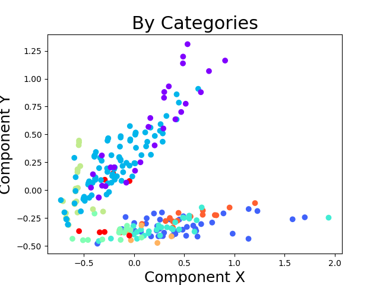

# Restauracja "Pod Złotymi Łukami"

## Dane 

Dane, którymi zajmujemy się tutaj zajmujemy to obserwacje reprezentujące dania.

W ramach posprzątania danych usunąłem dane nieliczbowe i znormalizowałem je (MinMax 0-1).
Usunąłem też kolumny, które nie wnosiły nic ponad to co już wiemy z pozostałych (czyli wykazują liniową korelację):

* 'Total Fat (% Daily Value)
* 'Saturated Fat (% Daily Value)
* 'Cholesterol (% Daily Value)
* 'Sodium (% Daily Value)
* 'Carbohydrates (% Daily Value)
* 'Dietary Fiber (% Daily Value)

Na tak przygotowanych danych wykonywałem dalszą część zadania.

\newpage

## Szacowanie jak "dobra" jest klasteryzacja

### Metryka

Wybrałem indeks Daveisa-Bouldina - który bierze pod uwagę stosunki rozrzucenia danych wewnątrz klastra do separacji pomiędzy klastrami
(krótko: im bardziej ściśnięte dane w klastrze i im dalej od innych klastrów tym lepiej) - czyli preferuje kule o jak najniższym promieniu.
Można sobie wyobrazić klastry gdzie niekoniecznie dane leżą wewnątrz kuli ale np wewnątrz pierścienia - ta metryka nie dałaby takiemu klastrowaniu
dobrej oceny.

Im niższa wartość, tym lepsza jest klasteryzacja.

## Obserwacja działania algorytmu dla kolejnych iteracji
Można zobaczyć jak inicjalizacja ma się do zbieżności, a także do osiąganego rozwiązania.
Widać, że inicjalizacja k-means++ zazwyczaj zaczynała od lepszego rozwiązania
(to podejście cechuje też najniższa wariancja) ale prowadziło do gorszego rozwiązania.  

Najlepiej radziło sobie losowanie każdego parametru z rozkładem jednostajnym - daje to dużą wariancję ale jest to pożądane
bo dajemy sobie większą szansę na znalezienie lepszego rozwiązania, wynika to ze stochastycznej natury algorytmu. 

Wyniki mierzyłem dla k = 5 i powtarzałem 50-krotnie.

\newpage

## Implementacja

Początkowo myślałem, że ciężko to będzie zrobić bez kopiowania 
kawałka implementacji SKLearna ale po dłuższej analizie kodu źródłowego okazało się, 
że można po prostu za każdym razem podawać poprzednio uzyskane środki klastrów jeśli tylko ustawimy maksymalną 
ilość iteracji na 1. 

\newpage

## Wybranie najlepszego K 

Wykres wydaje się być zastanawiający jeśli nie zdajemy sobie sprawy, że indeks najlepiej oceni klasteryzację gdzie każdy punkt jest
osobnym klastrem ( co uświadomiłem sobie na zajęciach ). Tak więc opierając się na tym wykresie można by uznać, że najlepsza klasteryzacja
jest dla k w przedziale 5-9. Najsensowniej byłoby zobaczyć czy inne metryki wykazują podobne tendencje.

## Wizualizacja rezultatów z wykorzystaniem PCA

Sprawdziłem kilka k w wybranym wyżej przedziale (wszystkie wyglądały w miarę sesnownie)

Dane faktycznie są zgrupowane w klastry nawet po wykonaniu PCA.
Widać, że grupowanie po kategoriach jest bardzo gruboziarniste i nie oddaje, tego jak dane (co do wartości) faktycznie się rozkładają.

Co do interpretacji to ciężko stwierdzić co zawiera każdy klaster. Elementry w klastrach są zgrupowane
dość równomiernie:

- 65
- 47
- 56
- 55
- 30
- 7 - ten klaster wydaje się być znacznie mniejszy od pozostałych i zbierać odrzutki.

## Wpływ przygotowania danych

Myślę, że przygotowanie danych miało bardzo duży wpływ na jakość klasteryzacji - na początku spróbowałem
zobaczyć co wyjdzie bez usuwania kolumn i wykres z indeksem Daviesa-Bouldina wydawał się ciągle maleć 
(ale bez wyraźnego spadku w pewnym miejscu) - więc właściwie to nic nie mówił (oprócz tego, że coś jest źle :)).

