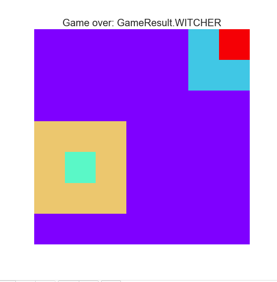
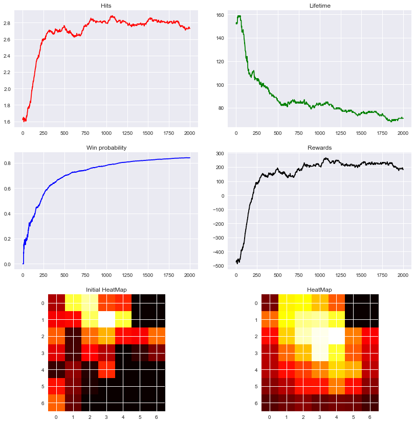
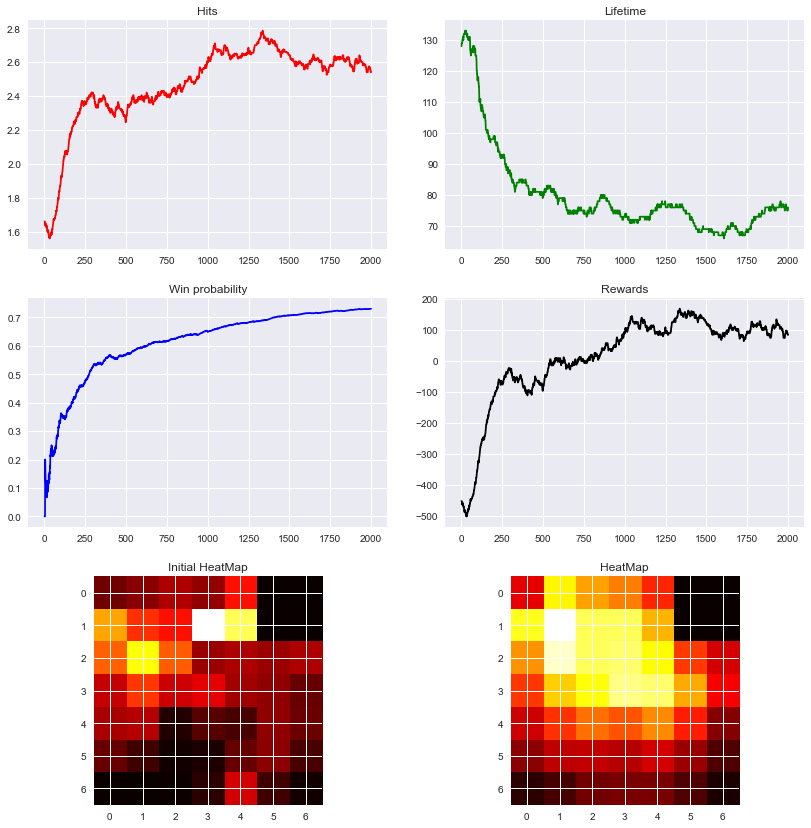
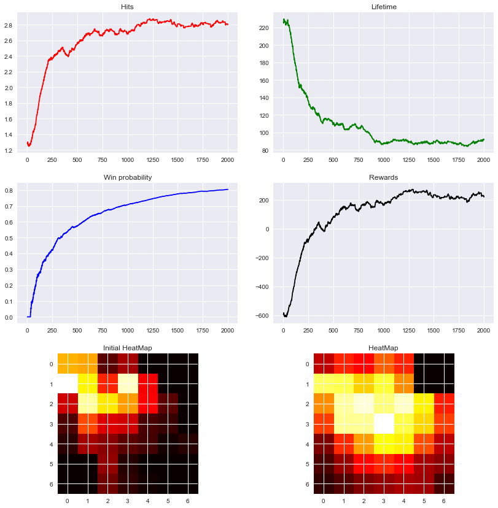
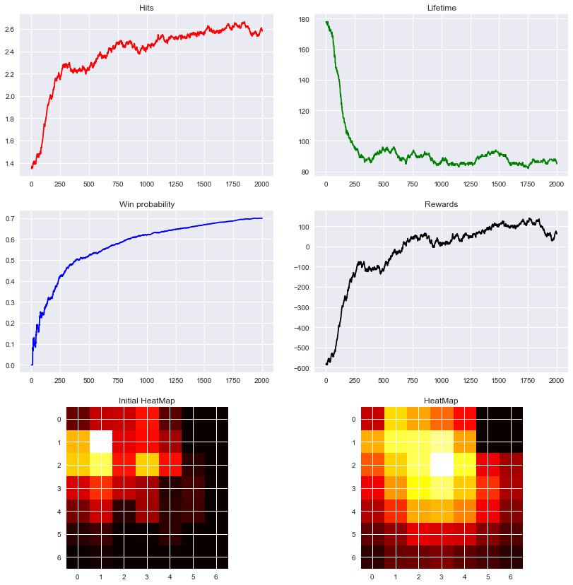
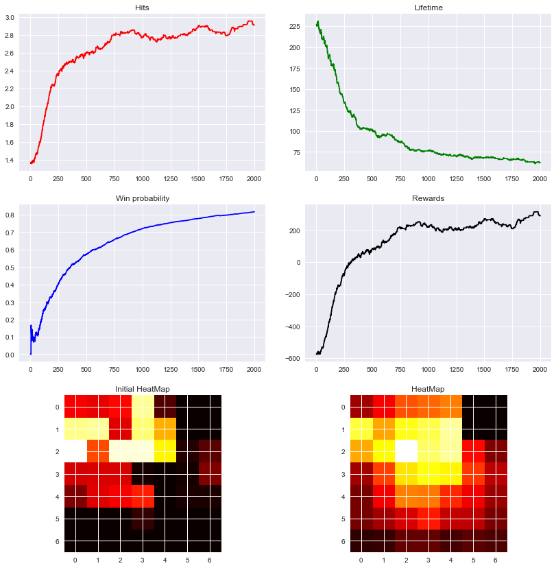
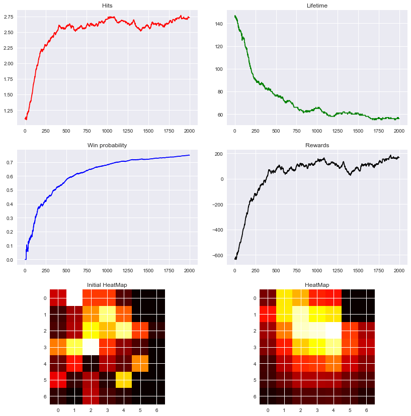
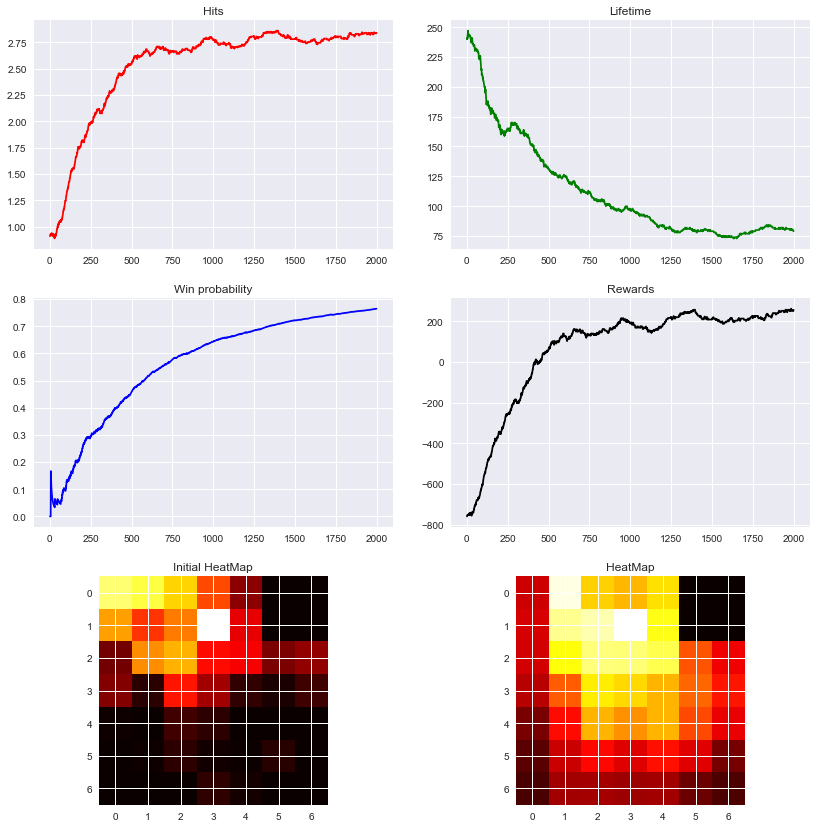
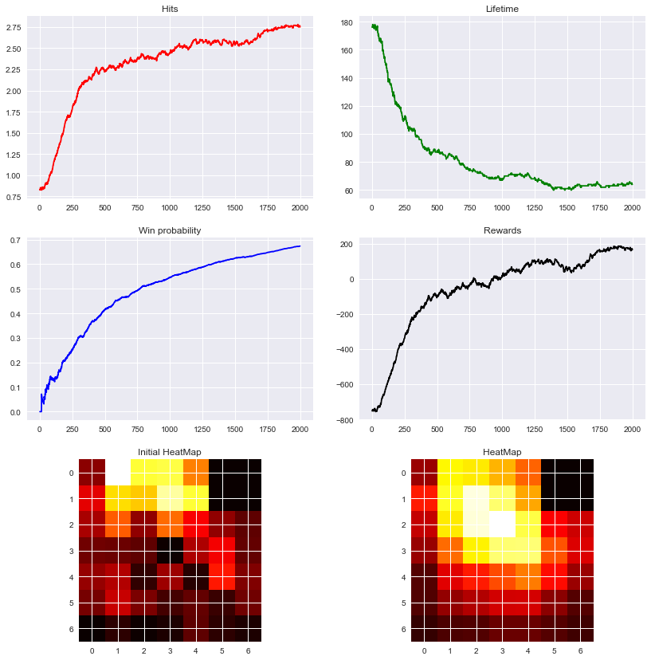
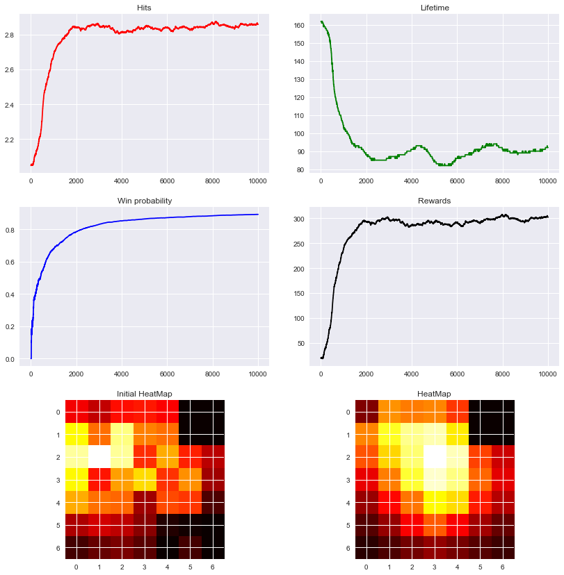

# Tlareg i Strzyga

Sama mechaniki gry jest taka jak w konspekcie więc opiszę tutaj tylko schematy poruszania się strzygi.
- W schemacie deterministycznym strzyga porusza się po kwadracie o określonym parametrem boku (3). Gdy dochodzi do 
krawędzi, to atakuje trzy pola, jedno w kierunku, w którym do tej pory się poruszała i dwa po bokach, następnie zmienia
kierunek i tak dalej. 
- W schemacie niedeterministycznym strzyga z 50% prawdopodobieństwem atakuje w taki sam sposób jak wyżej z tym, że 
teraz losuje też kierunek. Jeśli nie atakuje, to porusza się w losowym kierunku.
  
W obu tych scenariuszach przewagą wiedźmina jest fakt, że może on zbliżyć się do strzygi, 
tak aby móc ją uderzyć, a jednocześnie ona go nie mogła. Taka słabość strzygi daje wiedźminowi szanse, nawet gdy strzyga porusza się 
w sposób niedeterministyczny.

Zaznaczę jeszcze, że przypadek deterministyczny nie jest całkiem deterministyczny bo strzyga przylatuje z zamku do losowego
miejsca na swojej trasie.

## Mapa

Jako mapę wziąłem po prostu zamek w prawym górnym rogu i rozmiar 7x7 (aby ograniczyć cza uczenia).
Na żółto oznaczałem pola aktualnie atakowane, na czerwono strzygę.

\newpage

## Nagrody

Rozsądne wydaje się duża kara za oberwanie, duża nagroda za uderzenie strzygi i drobna nagroda
za przybliżanie się do strzygi (aby uniknąć zachowania, gdy wiedźmin niepotrzebnie przeciąga walkę lub nawet
ją przegrywa ze względu na czas).

Ostatecznie wybrałem:

- nagroda za przybliżanie się = 2.0
- nagroda za uderzenie strzygi = 100.0
- kara za porażkę = -1000.0 - wydaje się to być lekką przesadą, algorytm działa równie dobrze nawet jeśli zmniejszymy tę nagrodę
. W każdyn razie chciałem tą karą wyrazić fakt, że musimy uderzyć strzygę 3 razy a wystarczy, że raz oberwiemy żeby przegrać.

## Parametry 

Przygotwałem dwa zestawy parametrów:

- pasywny:
    - learning_rate = .5 (próbowałem też mniejszych, wyniki były podobne, na wykresach mam akurat tę wartość)
    - experiment_rate = .1
    - discount_factor = .1
    
- agresywny:
    - learning_rate = .9
    - experiment_rate = .25
    - discount_factor = .25
    
Nie obrałem tu wartości zupełnie ekstremalnych, tylko raczej takie które 
osiągają stosunkowo dobre wyniki.

## Słów kilka o parametrach:

  - learning_rate - im większa wartość parametru tym algorytm "chętniej" uaktualnia wartości funkcji Q na podstawie nowych obserwacji.
    Jeśli ustawimy tę wartość
    na niską, to algorytm będzie preferował zgromadzoną wiedzę względem nowych doświadczeń. 
    Dla deterministycznego przypadku wartość parametru bliska 1 wydaje się być najlepsza 
    bo jednokrotne odwiedzenie stanu daje nam wystarczającą wiedzę co zrobić tam kolejnym razem.
    W niedeterministycznym środowisku kluczowe jest wielokrotne poprawianie danej wartości funkcji Q tak aby po
    iluś próbach, iteracyjnie dojść do rozsądnego zachowania - dobra będzie tutaj niska wartość tego parametru.
    
  - expermient_rate - ten parametr odpowiada za próbowanie nowych doświadczeń o których możemy nic nie wiedzieć zamiast podążanie
                        za tym co mówi nam nasza wiedza (polityka). Ten parametr stara się walczyć z sytuacją, że algorytm utyka
                        na przeciętnych rozwiązaniach, bo na takie trafił, gdy zaczynał naukę, gdy obok są rozwiązania
                        dużo lepsze, których nie próbuje zbadać. Oczywiście ustawienie tego parametru na zbyt dużą wartość
                        powoduje, że zbyt bardzo ignorujemy naszą wiedzę, co ostatecznie nie daje nam dobrych rozwiązań.

  - discount_factor - czyli jak bardzo cenimy zyski teraz vs te później. W naszej grze rozsądne wydaje się być ustawienie
                        go na niską wartość jako, że jest to zręcznościówka - kluczowe jest to co zrobimy teraz. 
                        W grach środowiskach bardziej strategicznych większa wartość tego parametru byłaby pewnie lepszym wyborem.
    
\newpage
    
## Wyniki algorytmu SARSA

Dla środowiska deterministycznego z pasywnymi parametrami.

\newpage

Dla środowiska deterministycznego z agresywnymi parametrami.

\newpage

Dla środowiska niedeterministycznego z pasywnymi parametrami.

\newpage

Dla środowiska niedeterministycznego z agresywnymi parametrami.

\newpage

## Wyniki algorytmu QLearning

Dla środowiska deterministycznego z pasywnymi parametrami.

\newpage

Dla środowiska deterministycznego z agresywnymi parametrami.

\newpage

Dla środowiska niedeterministycznego z pasywnymi parametrami.

\newpage

Dla środowiska niedeterministycznego z agresywnymi parametrami.

\newpage

## Podsumowanie Wyników

Pasywne parametry osiągały bardzo dobre wyniki, natomiast im bardziej agresywne parametry próbowałem ustawić
tym gorzej radził sobie algorytm (ostatecznie zostałem przy dość lekko agresywnych, bo takowe nie odstawały zbytnio od tych paswnych).

W wykresach zatrzymuję się po 2 tysiącach gier, algorytm nie przestaje się wtedy uczyć ale proces uczenia trwa już długo (poniżej wykres dla 10k gier), 
a tendencja jest zachowana. Wykresy wygładziłem filtrem.

Heatmapy pokazują, że wiedźmin uczył się gdzie najlepiej czyhać na strzygę w deterministycznym środowisku.
Widać, że dużo czasu spędzał w prawym górnym rogu kwadratu po którym poruszała się strzyga. 
Dla niedeterministycznej strzygi musiał trochę za nią pochodzić po mapie.

Można by się też spodziewać, że na początku wiedźmin będzie dość losowo się poruszał a po uczeniu będzie preferował 
dobrze znane szlaki - tak też jest - choć heatmapy które pokazałem jako wczesne są po już pewnej części uczenia - są więc troszkę "biased".

Po oglądaniu zachowania wiedźmina doszedłem do wniosku, że nauczył się on słabości strzygi tzn. najcześciej atakował gdy
był po skosie od niej (czyli ona nie mogła go zaatakować), natomiast w pozostałych sytuacjach uciekał z pola rażenia.

Wykresy też dość jasno pokazują jakie nagrody ustawiałem - walki trwają dość długo bo nie daję zbyt dużych nagród za zbliżenie się,
kary są ujemne na początku bo kara za porażkę jest bardzo duża (co niedoświadczonemu wiedźminowi zdaża się często).

Co do parametrów algorytmów to przesadzenie z ich wartościami miało zazwyczaj negatywne skutki - mocno spowalniało zbieżność.
Np. gdy weźmiemy duży discount_factor to przełoży się to na długość gier.
Natomiast o ile nie były one zupełnie ekstremalne to algorytmy zbiegały i iteracyjnie poprawiały swoje wyniki.

Same algorytmy zachowują się podobnie, QLearning zbiega wolniej niż SARSa, co widac po wykresach prawd. wygranej.
Fakt, że zachowują się podobnie jest oczekiwany gdyż różnią się tylko tym, że Qlearning do uakutalnienia Q bierze najlepszą akcję 
(ale bez patrzenia na experiment_rate, albo z experiment_rate = 0), a do ostatecznego wyboru akcji stosuje experiment_rate tak samo
jak SARSa.

Spodziewałbym się, że dla tego problemu zbiegają do tej samej wartości (bo problem jest dość trywialny) - choć w ogólności
wcale tak nie musi być.

\newpage

#### Dla 10k gier.

