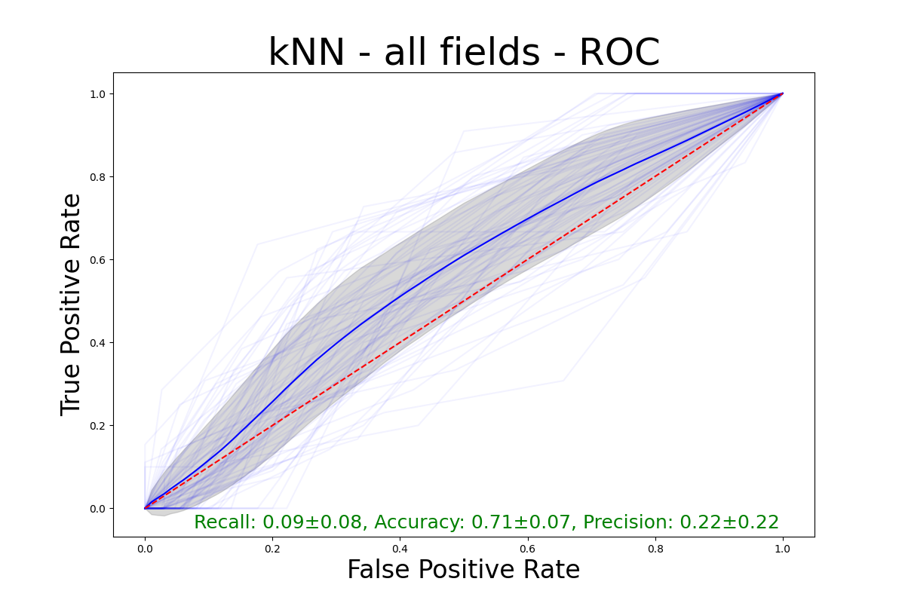

# Kolejny rzut oka na pandemię

## Dane


W ramach przygotowania danych usunąłem kolumny:
- 'Timestamp',
  
- 'CITY',
  
- 'Country',
  
- 'STATE',
  
- 'Are you above 18 Years of Age. '
  
- 'Would you be more likely or less likely to have a COVID-19 vaccination if it was recommended to you by each '
'of the following: [WHO]'

- 'Would you be more likely or less likely to have a COVID-19 vaccination if it was recommended to you by each '
'of the following: [Politicians]'

- 'Would you be more likely or less likely to have a COVID-19 vaccination if it was recommended to you by each '
'of the following: [Government Health Officials]'

- 'Would you be more likely or less likely to have a COVID-19 vaccination if it was recommended to you by each '
'of the following: [Doctors & Healthcare Staff ]'

- 'Would you be more likely or less likely to have a COVID-19 vaccination if it was recommended to you by each '
'of the following: [Friends and Fa,ily]'

- 'How concerned are you that you would experience a side effect from a COVID-19 vaccination?'


Dane z kolumny "If a vaccine to prevent COVID-19 was offered
to you today, would you choose to be vaccinated?" zmpaowałem do zbioru {"Yes", "No"} - 
"Yes, Probably" i "Yes, Definitely" do "Yes" pozostałe do "No".


Otrzymane wartości zmapowałem do wartości numerycznych:
- dla kolumn które miały "Yes" albo "No" do 1.0, 0.0
  
- dla kolumn, które miały kilka wartości do liniowej skali, na przykład:
  ```
      freq_dict = {
          'Always': 4.0,
          'Often': 3.0,
          'Sometimes': 2.0,
          'Rarely': 1.0,
          'Never': 0.0
      }
  ```
  
- została jeszcze jedna kolumna która zawierała kilka wymienionych chorób po przecinku,
tutaj zastosowałem `one-hot encoding`


\newpage

## Klasyfikatory

Wykorzystałem następujące klasyfikatory:

- kNN - biorący pod uwagę wszystkie cechy, k = 5
  
- kNN Subset - biorący pod uwagę tylko pewien podzbiór cech - wszelakie symptompy.
  
- RF - Random Forest - domyślny ze sklearna.
  
- RF All Traits - Random Forest - bez bootstrapowania i bez losowania cech na którym uczą się drzewa.

Można pomyśleć, że wszystkie drzewa będą takie same ale jest jeszcze jedno źródło wariancji, czyli
  permutacja features przy każdym splicie.


## Diagnostyka

Do podziału danych na część treningową i testową wykorzystałem 5-fold cross validation, i powtarzałem 10 razy.

Jako positive uznaję brak chęci na przyjęcie szczepienia.

Recall, accuracy, precision policzyłem dla progu czułości = 50% (default).

Klasyfikatory radziły sobie raczej przeciętnie z problemem, uzyskanie accuracy na poziomie 70% to był dobry wynik.

Ich krzywe ROC są bliższe tej krzywej losowego klasyfikatora niż idealnego. RF miał większą wariancję niż kNN
ale miał też lepsze wyniki - choć i tak przeciętne bo precision (czyli jaka część egzemplarzy zaklasyfikowanych jako
pozytywne faktycznie były pozytywne) na poziomie .3 to słaby wynik.




# Ważność Cech

5 najważniejszych cech dla klasyfikatora Random Forest. 
Właściwie to 3 są stabilne, pozostałe zmieniają się. 

Cechy, które mają największe znaczenie wydają się być rozsądne:

 - unikanie kontaku z ludźmi,
   
 - czy w ciągu 24h ktoś robił coś w co zamieszani byli inni ludzie,
   
 - czy ktoś używa maski na zewnątrz.


